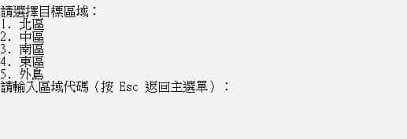

# CWA CODiS Crawler go

使用 Go 語言撰寫的交通部中央氣象署（CWA）[氣候觀測資料查詢服務（Climate Observation Data Inquire Service, CODiS）](https://codis.cwa.gov.tw/)自動測站數據擷取工具，於 Releases 已建置 Windows AMD64 封裝，若有其他環境需求可 go build 封裝至不同作業環境使用。

## 備註
偶爾會出現伺服器響應過慢或失敗的情況，若等待較久可直接關閉程式重新執行。  
未來考慮對此進行優化。

## 工具使用畫面

## 輸出欄位
下載的 CSV 檔案包含以下欄位：  
而並非所有測站都有所有欄位的資料，有些欄位可能為空值。

|	欄位名稱	|	說明	|
|	:--:	|	:--:	|	
|	DataDate	|	觀測時間(day)	|
|	WindSpeed	|	風速(m/s)	|
|	WindDirection	|	風向(360degree)	|
|	MaxAirTemperature	|	最高氣溫(℃)	|
|	MeanAirTemperature	|	氣溫(℃)	|
|	MinAirTemperature	|	最低氣溫(℃)	|
|	MaxAirTemperatureTime	|	最高氣溫時間(LST)	|
|	MinAirTemperatureTime	|	最低氣溫時間(LST)	|
|	MaxStationPressure	|	測站最高氣壓(hPa)	|
|	MinStationPressure	|	測站最低氣壓(hPa)	|
|	MeanStationPressure	|	測站氣壓(hPa)	|
|	MaxStationPressureTime	|	測站最高氣壓時間(LST)	|
|	MinStationPressureTime	|	測站最低氣壓時間(LST)	|
|	MaxRelativeHumidity	|	最高相對濕度	|
|	MinRelativeHumidity	|	最低相對濕度	|
|	MeanRelativeHumidity	|	相對溼度(%)	|
|	MaxRelativeHumidityTime	|	最高相對濕度時間	|
|	MinRelativeHumidityTime	|	最小相對溼度時間(LST)	|
|	MaxPeakGust	|	最大瞬間風(m/s)	|
|	MaxPeakGustTime	|	最大瞬間風風速時間(LST)	|
|	MaxPeakGustDirection	|	最大瞬間風風向(360degree)	|
|	AccumulationPrecipitation	|	累積降水量(mm)	|
|	HourlyMaxPrecipitation	|	最大時降水量(mm)	|
|	HourlyMaxPrecipitationTime	|	最大時降水量時間(LST)	|